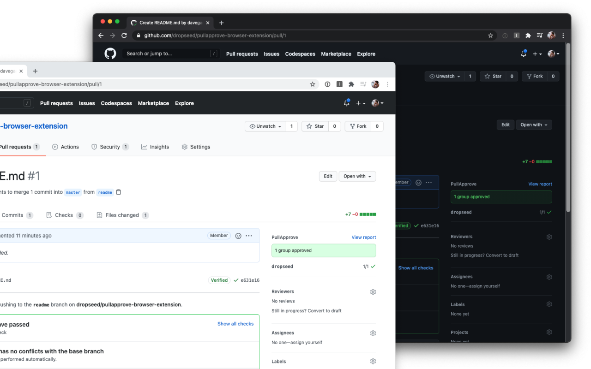

# pullapprove-browser-extension

This browser extension embeds PullApprove information directly into the GitHub UI.

When viewing a pull request,
you'll see a summary of the PullApprove status at the top of the sidebar,
and can always click through to the full report for additional information.

